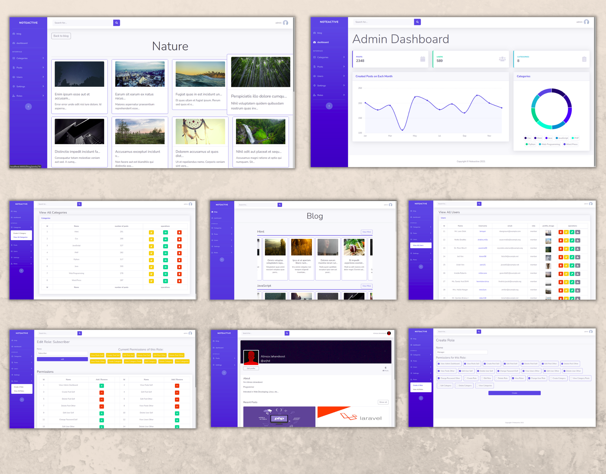

<div id="top"></div>

<!-- PROJECT SHIELDS -->
<!--
*** I'm using markdown "reference style" links for readability.
*** Reference links are enclosed in brackets [ ] instead of parentheses ( ).
*** See the bottom of this document for the declaration of the reference variables
*** for contributors-url, forks-url, etc. This is an optional, concise syntax you may use.
*** https://www.markdownguide.org/basic-syntax/#reference-style-links
-->
[![Contributors][contributors-shield]][contributors-url]
[![Forks][forks-shield]][forks-url]
[![Stargazers][stars-shield]][stars-url]
[![Issues][issues-shield]][issues-url]
[![MIT License][license-shield]][license-url]
[![LinkedIn][linkedin-shield]][linkedin-url]


<!-- PROJECT LOGO -->
<br />
<div align="center">
<!--   <a href="https://github.com/othneildrew/Best-README-Template">
    
  </a> -->

  <h3 align="center">NoteActive</h3>

  <p align="center">
    A simple social website with some features such as creating roles with desired permissions, creating posts with inline text editor, managing users, etc. 
    <br />
    <a href="https://github.com/alireza-jahandoost/NoteActive"><strong>Explore the docs »</strong></a>
    <br />
    <br />
<!--     <a href="https://alirezajahandoost.com/">View Website</a> -->
<!--     · -->
    <a href="https://github.com/alireza-jahandoost/NoteActive/issues">Report Bug</a>
    ·
    <a href="https://github.com/alireza-jahandoost/NoteActive/issues">Request Feature</a>
  </p>
</div>


<!-- TABLE OF CONTENTS -->
<details>
  <summary>Table of Contents</summary>
  <ol>
    <li>
      <a href="#about-the-project">About The Project</a>
      <ul>
        <li><a href="#built-with">Built With</a></li>
      </ul>
    </li>
    <li>
      <a href="#getting-started">Getting Started</a>
      <ul>
        <li><a href="#prerequisites">Prerequisites</a></li>
        <li><a href="#installation">Installation</a></li>
      </ul>
    </li>
    <li><a href="#usage">Usage</a></li>
    <li><a href="#roadmap">Roadmap</a></li>
    <li><a href="#contributing">Contributing</a></li>
    <li><a href="#license">License</a></li>
    <li><a href="#contact">Contact</a></li>
  </ol>
</details>


<!-- ABOUT THE PROJECT -->
## About The Project

<div align="center">
  <a href="https://github.com/alireza-jahandoost/NoteActive">
    
  </a>
</div>

This is a practical project, written with Laravel, to strengthen my understanding of laravel.

Features:
* Create posts with inline editor
* Categorize posts in categories
* Create new categories
* Create new roles with desired permissions
* Change users roles
* View post statistics

<p align="right">(<a href="#top">back to top</a>)</p>


### Built With

* [Laravel](https://laravel.com)
* [Boostrap](https://getbootstrap.com)
<p align="right">(<a href="#top">back to top</a>)</p>


<!-- GETTING STARTED -->
## Getting Started

### Prerequisites

To run this project in your pc, you need:
* php
* a database server such as mysql
* a web server such as apache
* nodejs and npm

### Installation

1. Clone the repo
   ```sh
   git clone https://github.com/alireza-jahandoost/NoteActive
   ```
2. Move to the directory
   ```sh
   cd NoteActive
   ```
3. Configure `.env` file
   ```sh
   cp .env.example .env
   ```
4. Install php dependencies
   ```sh
   composer install
   ```
5. Install js dependencies
   ```sh
   npm install && npm run dev
   ```
6. Generate key
   ```sh
   php artisan key:generate
   ```
7. Create database tables
   ```sh
   php artisan migrate
   ```

<p align="right">(<a href="#top">back to top</a>)</p>


<!-- USAGE EXAMPLES -->
## Usage

To run the project, you need to serve it:
   ```sh
   php artisan serve
   ```
Then, you can login to admin account in `http://localhost:8000/login` url.

username: `admin@admin.com`

password: `admin`

<p align="right">(<a href="#top">back to top</a>)</p>


<!-- ROADMAP -->
## Roadmap

- [ ] add support of leaving comments
- [ ] add support of liking and disliking others' posts
- [ ] create tests

See the [open issues](https://github.com/alireza-jahandoost/Portfolio/issues) for a full list of proposed features (and known issues).

<p align="right">(<a href="#top">back to top</a>)</p>


<!-- CONTRIBUTING -->
## Contributing

Contributions are what make the open source community such an amazing place to learn, inspire, and create. Any contributions you make are **greatly appreciated**.

If you have a suggestion that would make this better, please fork the repo and create a pull request. You can also simply open an issue with the tag "enhancement".
If you do not have a specific idea, and you want to contribute, you can choose one of the issues and try to complete that one.
Don't forget to give the project a star! Thanks again!

1. Fork the Project
2. Create your Feature Branch (`git checkout -b feature/AmazingFeature`)
3. Commit your Changes (`git commit -m 'Add some AmazingFeature'`)
4. Push to the Branch (`git push origin feature/AmazingFeature`)
5. Open a Pull Request

<p align="right">(<a href="#top">back to top</a>)</p>


<!-- LICENSE -->
## License

Distributed under the MIT License. See `LICENSE` for more information.

<p align="right">(<a href="#top">back to top</a>)</p>


<!-- CONTACT -->
## Contact

Alireza Jahandoost - alireza.jhd2000@gmail.com

Project Link: [https://github.com/alireza-jahandoost/NoteActive](https://github.com/alireza-jahandoost/NoteActive)

<p align="right">(<a href="#top">back to top</a>)</p>

<!-- MARKDOWN LINKS & IMAGES -->
<!-- https://www.markdownguide.org/basic-syntax/#reference-style-links -->
[contributors-shield]: https://img.shields.io/github/contributors/alireza-jahandoost/NoteActive.svg?style=for-the-badge
[contributors-url]: https://github.com/alireza-jahandoost/NoteActive/graphs/contributors
[forks-shield]: https://img.shields.io/github/forks/alireza-jahandoost/NoteActive.svg?style=for-the-badge
[forks-url]: https://github.com/alireza-jahandoost/NoteActive/network/members
[stars-shield]: https://img.shields.io/github/stars/alireza-jahandoost/NoteActive?style=for-the-badge
[stars-url]: https://github.com/alireza-jahandoost/NoteActive/stargazers
[issues-shield]: https://img.shields.io/github/issues/alireza-jahandoost/NoteActive.svg?style=for-the-badge
[issues-url]: https://github.com/alireza-jahandoost/NoteActive/issues
[license-shield]: https://img.shields.io/github/license/alireza-jahandoost/NoteActive.svg?style=for-the-badge
[license-url]: https://github.com/alireza-jahandoost/NoteActive/blob/master/LICENSE
[linkedin-shield]: https://img.shields.io/badge/-LinkedIn-black.svg?style=for-the-badge&logo=linkedin&colorB=555
[linkedin-url]: https://www.linkedin.com/in/alireza-jahandoost
[product-screenshot]: images/screenshot.png
